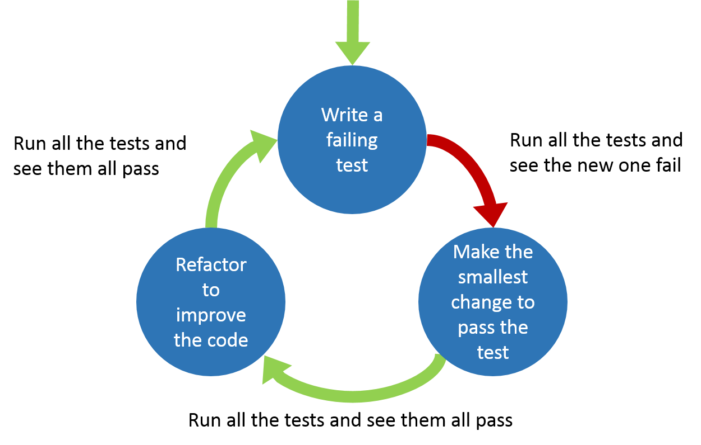

### Testing apps

  

by *Jordi Pujol*, *Guillermo Guerrero*, and *Adrián Moreno*
 
@ *Tarragona Developers Meetup - 25/01/2017*

---

### Why testing software is important?

* Confidence
* Fix and prevent bugs
* Provide support for refactoring
* Enables teams to move quicker

----

### Functional tests

* a.k.a Acceptance, End-to-End, Black box, Browser testing
* Test the application from the outside
* Based on a User Story

----

### Functional tests

- Negative scenarios
- Forms
- File manipulation and calculations
- Search
- Media components

----

### Unit tests

* Test the application from the inside
* Small pieces of code, typically individual functions
* give input -> validate output
* If test has external dependencies, mock them

----

### Other tests

* UI and Usability Testing
* Integration Testing
* Performance Testing
* Security Testing

----

TDD or not TDD?

----

### TDD Cycle

---

## What about code quality?

---

# Demo

---

# Thank you

## Questions?

   

[tgndevs.github.io/slides/testing](http://tgndevs.github.io/slides/testing)

